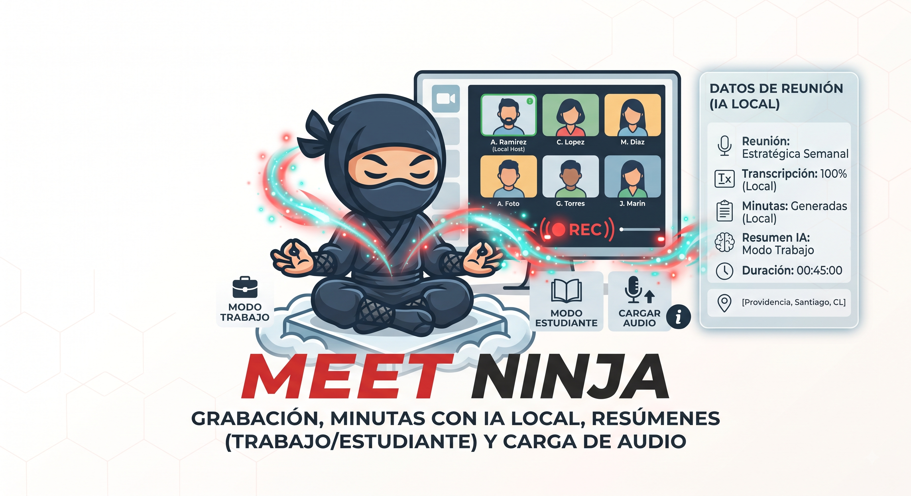

# 🥷 Meet Ninja

> **Transcripción y resumen de reuniones con IA, 100% local y open source.**



Meet Ninja es una aplicación de escritorio que graba audio, lo transcribe
con Whisper, y genera resúmenes inteligentes con un LLM local. Todo corre
en tu PC — no hay servicios en la nube, no se envía nada a internet.

---

## ✨ Features

- 🎙️ **Grabación de audio** desde micrófono, audio del sistema, o ambos
- 📝 **Transcripción** con [faster-whisper](https://github.com/SYSTRAN/faster-whisper) (modelo `small`, corre en CPU)
- 🧠 **3 modos de resumen**:
  - 🗂️ **Reunión** — minuta formal con asistentes, agenda, decisiones y tareas
  - 📚 **Estudio** — conceptos clave, definiciones, bloques temáticos
  - 🗨️ **Conversación** — registro conversacional fiel
- 🔍 **Búsqueda de palabras clave** tipo diccionario, modo ANY/ALL
- 💬 **Chat con la transcripción** (RAG) — preguntale al LLM sobre la reunión
- 🌐 **Traducción** a múltiples idiomas
- 🪟 **Multi-sesión** — maneja varias reuniones en paralelo
- 💾 **Persistencia local** (sesiones en localStorage, audio en IndexedDB)
- 🌗 **Modo claro/oscuro** + i18n (Español / English / Português)
- 🔄 **Auto-actualización** desde GitHub Releases
- 🔒 **Privacidad total** — todo es local, no sale nada de tu PC

---

## 📥 Instalación

### Opción A: Portable (recomendada para probar)

1. Bajá el `.zip` de la sección [Releases](https://github.com/jaguayoara/meet-ninja/releases)
2. Descomprimí en cualquier carpeta
3. Doble click en `Meet Ninja.exe`

> ⚠️ Si Windows muestra SmartScreen ("origen desconocido"), clickeá
> **Más información** → **Ejecutar de todas formas**. Es estándar para
> apps open-source sin firma de código.

### Opción B: Instalador NSIS

1. Bajá el `Meet Ninja Setup x.x.x.exe` de [Releases](https://github.com/jaguayoara/meet-ninja/releases)
2. Ejecutá y seguí el wizard

> Solo disponible en releases construidos con Developer Mode activado o
> desde una consola con permisos de admin.

---

## 🛠️ Requisitos del sistema

| Recurso | Mínimo | Recomendado |
|---|---|---|
| SO | Windows 10+ | Windows 10/11 |
| RAM | 8 GB | 16 GB |
| CPU | Cualquier x64 con SSE4 | 4+ cores |
| GPU | No requerida (CPU-only) | — |
| Disco | 2.5 GB para la app + modelos | SSD |
| **Python** | **No se necesita** | — |

**No tenés que instalar nada.** Meet Ninja embebe su propio CPython portable
(una build relocatable de [python-build-standalone](https://github.com/astral-sh/python-build-standalone)),
el modelo de Whisper y el LLM local. Escribí el audio y listo.

> ¿Por qué Python portable y no un venv? Porque los venvs **no son portables**:
> su `pyvenv.cfg` apunta a la ruta absoluta del Python base de la máquina que
> los creó, así que fallan en cualquier otro equipo. Un CPython relocatable
> funciona desde cualquier carpeta y en cualquier PC, sin permisos de admin.

Testeado en PCs de oficina sin GPU dedicada con 8 GB RAM. La primera
ejecución tarda ~60-90s mientras levanta el LLM local; después responde
en 2-10s por consulta.

---

## 🚀 Uso rápido

1. **Nueva sesión** desde el menú principal
2. **Grabá audio** o **cargá un archivo** (.wav, .mp3, .m4a, .ogg, .flac, .webm)
3. Click **Transcribir audio** → la transcripción aparece en la pestaña
4. Click **Modo Reunion / Estudio / Conversación** → resumen generado localmente
5. **Buscá** palabras en la pestaña Buscar (modo ANY/ALL)
6. **Chateá** con la transcripción en la pestaña Conversar

Todo se guarda automáticamente. Podés cerrar y abrir la app cuando quieras.

---

## 🏗️ Arquitectura

```
┌────────────────────────────────────────────────────────┐
│                    Electron (Main)                     │
│  ┌──────────┐  ┌──────────┐  ┌──────────────────────┐ │
│  │ Renderer │  │ Preload  │  │ Main Process (Node)  │ │
│  │ (React)  │←→│ context- │←→│ - Spawn Python       │ │
│  │          │  │ isolation│  │ - Auto-updater       │ │
│  └──────────┘  └──────────┘  │ - desktopCapturer    │ │
│                              └──────────────────────┘ │
└──────────────────────────┬─────────────────────────────┘
                           │ http://127.0.0.1:8765
┌──────────────────────────▼─────────────────────────────┐
│              Backend Python (FastAPI)                  │
│  ┌────────────┐  ┌────────────┐  ┌──────────────────┐  │
│  │ Whisper    │  │ LLM local  │  │ Ollama (opcional)│  │
│  │ (CPU)      │  │ (llama.cpp)│  │ qwen/llama/gemma │  │
│  │ small: 460MB│  │ Qwen2.5 1.5B│  │ (auto-detect)    │  │
│  └────────────┘  └────────────┘  └──────────────────┘  │
└────────────────────────────────────────────────────────┘
```

Stack:
- **Electron 32** + **Vite 5** + **React 18** + **TypeScript** + **Zustand**
- **FastAPI** + **faster-whisper** + **llama-server** (Qwen2.5-1.5B-Instruct Q4_K_M)
- **electron-builder** + **electron-updater**

---

## 🧑‍💻 Desarrollo

```bash
# 1. Instalar deps Node
npm install

# 2. Setup del backend Python (Windows)
powershell -ExecutionPolicy Bypass -File scripts/setup-python.ps1

# 3. Dev mode (Vite + Electron + Python backend)
npm run dev
```

Build de producción:
```bash
npm run build          # Compila frontend + main process
npm run package:win    # Genera win-unpacked/ + instalador NSIS
```

---

## 🐛 Troubleshooting

| Problema | Solución |
|---|---|
| "No se pudo iniciar el backend Python" | Ejecutá `scripts\setup-python.ps1` |
| SmartScreen bloquea el .exe | "Más info" → "Ejecutar de todas formas" |
| El LLM responde muy lento | Cerrá otras apps pesadas. La primera consulta tarda más. |
| Audio del sistema no se escucha | En la app: "Audio del sistema" o "Ambos". El sistema debe permitir compartir audio. |
| Quiero cambiar el modelo de Whisper | En la sidebar: dropdown "Modelo de Whisper" (tiny/base/small/medium/large-v3) |
| Quiero usar un LLM mejor | Instalá Ollama + `ollama pull qwen2.5:3b`. Meet Ninja lo auto-detecta. |

---

## 📝 Licencia

MIT © 2026 Jorge Aguayo

---

## 🙏 Agradecimientos

- [OpenAI Whisper](https://github.com/openai/whisper) + [faster-whisper](https://github.com/SYSTRAN/faster-whisper)
- [llama.cpp](https://github.com/ggerganov/llama.cpp) + [Qwen2.5](https://huggingface.co/Qwen)
- [Electron](https://www.electronjs.org/) + [Vite](https://vitejs.dev/) + [React](https://react.dev/)
- [Ollama](https://ollama.com/) (opcional, para LLMs más grandes)
